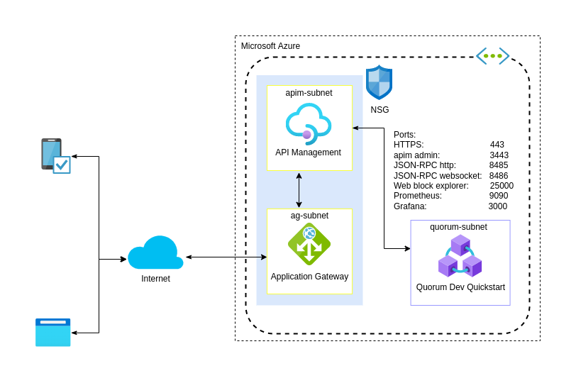

# 部署以太坊测试环境

Created: June 10, 2022 5:02 PM
Tags: Ethereum, Quorum

这是一系列“关于如何在私有环境中发布NFT”文章中的第一篇，我希望通过这些文章揭开NFT的面纱，让大家可以在私有环境学习如何发布的NFT。还可以通过这些文章认识智能合约，并在开始学习编写智能合约的时候，知道如何搭建环境来开发、测试和部署自己的智能合约。

关于开发测试环境我使用在Microsoft Azure公有云中部署的Quorum Developer Quickstart虚拟机。它基于GoQuorum Docker镜像来运行一个由Docker Compose管理的GoQuorum节点的私有IBFT(Istanbul Byzantine Fault Tolerant)网络。GoQuorum是一个私有的、基于Ethereum协议的官方Go实现的区块链

除了虚拟机之外，我还会使用一个网关来做为整个环境的入口，因为最终我们会将发布的NFT添加到电子钱包(MetaMask)中，这样我们需要一个公网地址和域名，以及一张证书。但最重要的是我们需要保护虚拟机不被攻击，所以我又添加了API Management和Application Gateway两个云服务。以下就是整个环境的拓扑图

### 架构拓扑图



### 在Azure中部署以太坊测试环境

首先我们需要一个Azure订阅，可以在[Azure官网](https://azure.microsoft.com/zh-cn/free/)申请免费账户，在Azure市场中搜索Quorum Dev Quickstart


选择创建


选择资源组、区域，填入管理员名称、密钥


选择虚拟机规格大小


选择网络配置


点击创建


创建成功


### 配置Quorum

通过SSH登录

```bash
ssh username@vmipaddress
```

运行run.sh，进入配置

```bash
./run.sh
```

选择2

```bash
Which Ethereum client would you like to run? Default: [1]
	1. Hyperledger Besu
	2. GoQuorum
```

选择N

```bash
Do you want to try out Codefi Orchestrate? [Y/n]
```

选择N

```bash
Do you want to try out Quorum Key Manager? [Y/n]
```

选择Y

```bash
Do you wish to enable support for private transactions? [Y/n]
```

选择1

```bash
Do you wish to enable support for logging with Splunk or ELK (Elasticsearch, Logstash & Kibana)? Default: [1]
	1. None
	2. Splunk
	3. ELK
```

选择N

```bash
Do you wish to enable support for monitoring your network with Blockscout? [N/y]
```

最后确认，并直接回车创建quorum-test-network目录

```bash
___
             / _ \   _   _    ___    _ __   _   _   _ __ ___
            | | | | | | | |  / _ \  | '__| | | | | | '_ ' _ \
            | |_| | | |_| | | (_) | | |    | |_| | | | | | | |
             \__\_\  \__,_|  \___/  |_|     \__,_| |_| |_| |_|

        ____                          _
       |  _ \    ___  __   __   ___  | |   ___    _ __     ___   _ __
       | | | |  / _ \ \ \ / /  / _ \ | |  / _ \  | '_ \   / _ \ | '__|
       | |_| | |  __/  \ V /  |  __/ | | | (_) | | |_) | |  __/ | |
       |____/   \___|   \_/    \___| |_|  \___/  | .__/   \___| |_|
                                                 |_|
       ___            _          _            _                    _
      / _ \   _   _  (_)   ___  | | __  ___  | |_    __ _   _ __  | |_
     | | | | | | | | | |  / __| | |/ / / __| | __|  / _' | | '__| | __|
     | |_| | | |_| | | | | (__  |   <  \__ \ | |_  | (_| | | |    | |_
      \__\_\  \__,_| |_|  \___| |_|\_\ |___/  \__|  \__,_| |_|     \__|

Welcome to the Quorum Developer Quickstart utility. This tool can be used
to rapidly generate local Quorum blockchain networks for development purposes
using tools like GoQuorum, Besu, and Codefi Orchestrate.

To get started, be sure that you have both Docker and Docker Compose
installed, then answer the following questions.

Which Ethereum client would you like to run? Default: [1]
	1. Hyperledger Besu
	2. GoQuorum
2
Do you want to try out Codefi Orchestrate? [Y/n]
n
Do you want to try out Quorum Key Manager? [Y/n]
n
Do you wish to enable support for private transactions? [Y/n]
y
Do you wish to enable support for logging with Splunk or ELK (Elasticsearch, Logstash & Kibana)? Default: [1]
	1. None
	2. Splunk
	3. ELK
1
Do you wish to enable support for monitoring your network with Blockscout? [N/y]
n
Where should we create the config files for this network? Please
choose either an empty directory, or a path to a new directory that does
not yet exist. Default: ./quorum-test-network
```

进入quorum-test-network目录

```bash
cd ./quorum-test-network
```

运行run.sh，等待运行结束

```bash
./run.sh
```

部署成功

```bash
Status: Downloaded newer image for grafana/grafana:latest
Creating quorum-test-network_validator4_1     ... done
Creating quorum-test-network_grafana_1        ... done
Creating quorum-test-network_member1tessera_1 ... done
Creating quorum-test-network_validator2_1     ... done
Creating quorum-test-network_validator3_1     ... done
Creating quorum-test-network_member3tessera_1 ... done
Creating quorum-test-network_prometheus_1     ... done
Creating rpcnode                              ... done
Creating quorum-test-network_validator1_1     ... done
Creating quorum-test-network_member2tessera_1 ... done
Creating quorum-test-network_member1quorum_1  ... done
Creating quorum-test-network_member2quorum_1  ... done
Creating quorum-test-network_member3quorum_1  ... done
Creating quorum-test-network_explorer_1       ... done
*************************************
Quorum Dev Quickstart 
*************************************
----------------------------------
List endpoints and services
----------------------------------
JSON-RPC HTTP service endpoint                 : http://localhost:8545
JSON-RPC WebSocket service endpoint            : ws://localhost:8546
Web block explorer address                     : http://localhost:25000/explorer/nodes
Prometheus address                             : http://localhost:9090/graph
Grafana address                                : http://localhost:3000/d/a1lVy7ycin9Yv/goquorum-overview?orgId=1&refresh=10s&from=now-30m&to=now&var-system=All

For more information on the endpoints and services, refer to README.md in the installation directory.
****************************************************************
```

### 创建Azure API Management

当创建完Quorum VM之后，我们发现Quorum会暴露一些管理端口，但从安全角度考虑我们不能把这些端口直接暴露在公网上。另一方面，我们将来还希望通过移动设备的电子钱包（MetaMask）连接到这个测试环境，所以我们还需要通过HTTPS协议来访问JSON-RPC HTTP端口。这样我们就需要在Quorum VM的前端部署一个网关来管理和发布这些API。我们使用Azure API Management来实现这部分功能

首先需要扩展Quorum VM的虚拟网络，增加一个地址空间


以及子网地址，并关联到Quorum VM的网络安全组（NSG）。


此外还需要一个公网IP，用于APIM的网关地址（架构的拓扑图中还有一个部分是应用程序网关（Application Gateway），但在实际部署中并没有这部分，是因为APIM自带一个默认网关，所以在Demo环境中直接使用了此网关。）


准备工作做完之后，我们就可以开始创建Azure API Management


其他都是默认，在配置虚拟网络的时候选择之前Quorum VM的虚拟网络，并选择新建的子网地址和IP地址


完成后点击创建，创建时间会比较长需要耐心等待。


经过漫长等待，API Management终于创建并激活完成。我们需要在APIM中新建一个API，在Web service URL中填写后端Quorum VM的公网IP地址。


之所以依然使用公网地址的原因是因为还需要通过SSH登录到Quorum VM，但其他的管理端口可以通过NSG进行限制，只允许网关的IP地址访问，这样实际在公网可以访问的端口只有SSH和HTTPS，以及APIM的管理端口3443。


创建好API之后，再创建一个POST方法用来测试API，需要在Headers中添加Content-Type键值，Type为String，Values为application/json，Required为true。如果需要访问其他的管理端口，也可以在APIM中开放。我在Demo环境中就不再举例了


测试成功，可以看到HTTP状态码为200


还需要在移动端的电子钱包（MetaMask）中测试，确保电子钱包可以正常访问RPC服务，如果服务可以正常访问，链ID就会获取到Quorum的默认ID：1337。到这里Azure端的以太坊测试开发环境就部署完成了。

<div align=center >

</div>